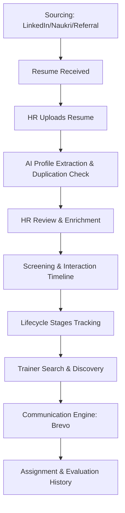

# Business Requirements Document (BRD)
## Project Title: Wrench Wise Trainer Management System (WW-TMS)

---

### 1. Executive Summary
Wrench Wise requires a centralized internal platform to manage trainer sourcing, profiling, communication, and allocation.

Today, trainer information is spread across resumes, emails, WhatsApp chats, LinkedIn sourcing, Naukri downloads, referrals, and individual team knowledge. This leads to duplicate outreach, inconsistent commercial discussions, lack of visibility into trainer availability, and delays in identifying the right trainer.

The proposed **Wrench Wise Trainer Management System (WW-TMS)** will serve as a single source of truth for trainer intelligence, helping HR, Operations, and Academic teams collaborate efficiently.

#### Core Capabilities:
- **Resume Intake & AI-Based Profile Extraction**: Automatic parsing of resumes.
- **Trainer Profile Management**: Single database for maintaining detailed records.
- **Commercial & Availability Tracking**: Tracking engagement rates and schedules.
- **Conversation History Logging**: A central timeline of all touchpoints.
- **Trainer Search & Discovery**: Fast lookup by skills, location, cost, and availability.
- **Email Communication**: Sending emails through branded channels.
- **Assignment History & Lifecycle Tracking**: Moving trainers from intake to active delivery.

---

### 2. Business Need
Wrench Wise needs a structured system because currently:
- Trainer data is fragmented.
- Resume review is manual and time-consuming.
- Multiple team members may contact the same trainer without context (duplicate outreach).
- Negotiation history is not centrally available.
- Availability data becomes outdated quickly.
- Finding the right trainer for a specific training take too long.

**Business Goal**: Reduce operational dependency on individual memory and create a scalable, structured trainer intelligence workflow.

---

### 3. Users
1. **HR / Talent Team**: Responsible for sourcing trainers, uploading resumes, conducting screening conversations, and maintaining trainer information.
2. **Operations Team**: Responsible for searching trainers, checking availability, coordinating follow-ups, and assignment readiness.
3. **Academic Team**: Responsible for evaluating technical capability, demo feedback, and trainer suitability.
4. **Admin**: Responsible for platform settings, integrations, access control, and templates.
5. **Leadership**: Responsible for visibility, reporting, and strategic oversight.

---

### 4. Functional Flows



#### Flow 1: Trainer Intake
Trainer profiles may enter the system from various sourcing channels:
- LinkedIn, Naukri, Referrals, Word of mouth, Direct applications, or Existing offline databases.
- **Process**: Resume received → HR uploads resume → Sourcing channel is tagged → Resume stored → AI extraction begins.
- **Outcome**: A draft trainer profile is created.

#### Flow 2: AI Resume Intelligence
- **Supported Formats**: PDF, DOC/DOCX, TXT, and scanned image resumes.
- **Extracted Fields**:
  - *Basic Details*: Name, Email, Phone number, LinkedIn profile, Location.
  - *Professional Details*: Current employer, Designation, Total experience, Teaching experience (where identifiable).
  - *Skills & Certifications*: Primary and secondary technologies, certificates.
  - *Education*: Degrees, institutions, graduation years.
- **Outcome**: A structured draft trainer profile is generated for review (always remains editable).

#### Flow 3: HR Enrichment & Screening
After the initial conversation, HR/Operations enrich the profile with business-critical details not present in standard resumes:
- **Engagement Preference**: Full-time, Freelancer, Consultant, Visiting faculty.
- **Commercial Expectations**: Current CTC, Expected CTC, Hourly expectation, Daily rate, Per session pricing, Per batch expectation, and Negotiability.
- **Operational Preferences**: Online/Offline/Hybrid, Travel willingness, Location preferences, Availability timeline.
- **Audience Fit**: Students, Working professionals, Corporate learners.
- **Outcome**: The trainer profile becomes operationally searchable and usable.

#### Flow 4: Interaction History (Timeline)
Every interaction with the trainer must be recorded to preserve institutional memory.
- **Interaction Fields**: Date & time, Team member name, Interaction type (Call, Email, WhatsApp, Demo, Negotiation), Summary, Trainer standpoint, Key concerns, Next action, and Follow-up date.
- **Outcome**: Any team member can instantly understand prior negotiation/discussion context before contacting the trainer.

#### Flow 5: Trainer Lifecycle Tracking
Clear movement through defined operational stages:
```
New Profile ➔ Contact Pending ➔ Contacted ➔ Interested ➔ Follow-up Required ➔ Demo Scheduled ➔ Approved ➔ Assigned ➔ Active ➔ Inactive
```
- **Outcome**: Seamless cross-team coordination and tracking.

#### Flow 6: Trainer Search & Discovery
Operations can query the entire candidate base instantly.
- **Search Filters**: Skill, Experience, Location, Availability, Engagement type, Language, Commercial range, Delivery mode, Status.
- **Outcome**: Fast, accurate trainer shortlisting.

#### Flow 7: Communication Engine
Direct email communication from trainer profiles using Wrench Wise branded identities.
- **Use Cases**: Sourcing outreach, Screening invites, Demo scheduling, Follow-ups, Assignment confirmations, Re-engagement.
- **Integrations (Target)**: Brevo.
- **Email Identities**:
  - `talent@wrenchwise.in`
  - `trainers@wrenchwise.in`
  - `faculty@wrenchwise.in`
  - `recruitment@wrenchwise.in`
- **Outcome**: Centralized, trackable correspondence inside the trainer history timeline.

#### Flow 8: Duplicate Prevention
Prevent fragmented records and duplicate team communications.
- **Matching Logic**: Email address, Phone number, LinkedIn URL, or Similar name + location.
- **Outcome**: Cleaner database, reduced candidate friction.

#### Flow 9: Assignment History
Keep track of past assignments to evaluate performance and match suitability for future projects.
- **Fields Captured**: Program/Course name, Delivery dates, Delivery mode, Audience type, Internal rating (1-5 stars), and Review notes.
- **Outcome**: Higher success rates for future student/corporate training assignments.

---

### 5. Functional Modules
1. **Resume Intake**
2. **AI Resume Parsing (Mock/Actual)**
3. **Trainer Profile Management**
4. **HR Enrichment & Commercials**
5. **Interaction Timeline**
6. **Lifecycle Tracking**
7. **Search & Discovery Engine**
8. **Email Communication (Brevo Simulator)**
9. **Duplicate Detection & Merge Interface**
10. **Assignment History**
11. **Reporting & Analytics Dashboard**

---

### 6. Suggested Technology Stack
- **Frontend**: React / Next.js
- **Backend**: FastAPI
- **Database**: PostgreSQL
- **Document Storage**: AWS S3
- **OCR / Parsing**: AWS Textract & OpenAI API
- **Email Delivery**: Brevo
- **Search**: Elasticsearch

---

### 7. Success Criteria
- Faster trainer matching and discovery.
- Reduced duplicate outreach and recruiter confusion.
- Absolute cross-team transparency between HR, Academic, and Operations.
- Unified, visible commercial negotiations history.

---

### 8. Future Enhancements
- WhatsApp Business API integration.
- Automated email/WhatsApp reminders for schedules.
- Smart AI Trainer recommendation based on program syllabus.
- Self-service Trainer portal for schedule updates.
- Google Calendar / Outlook integration.
